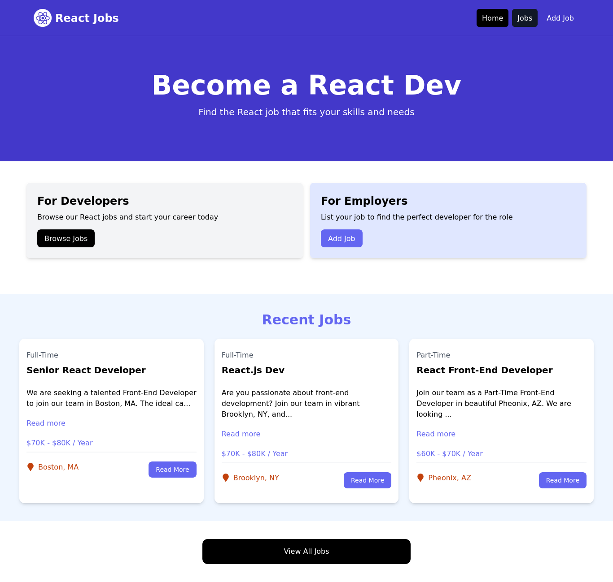
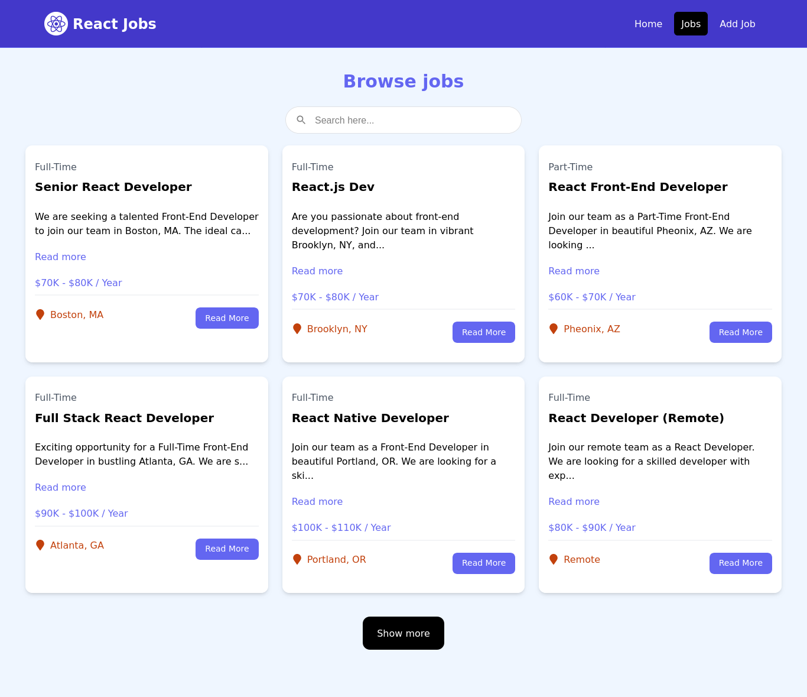
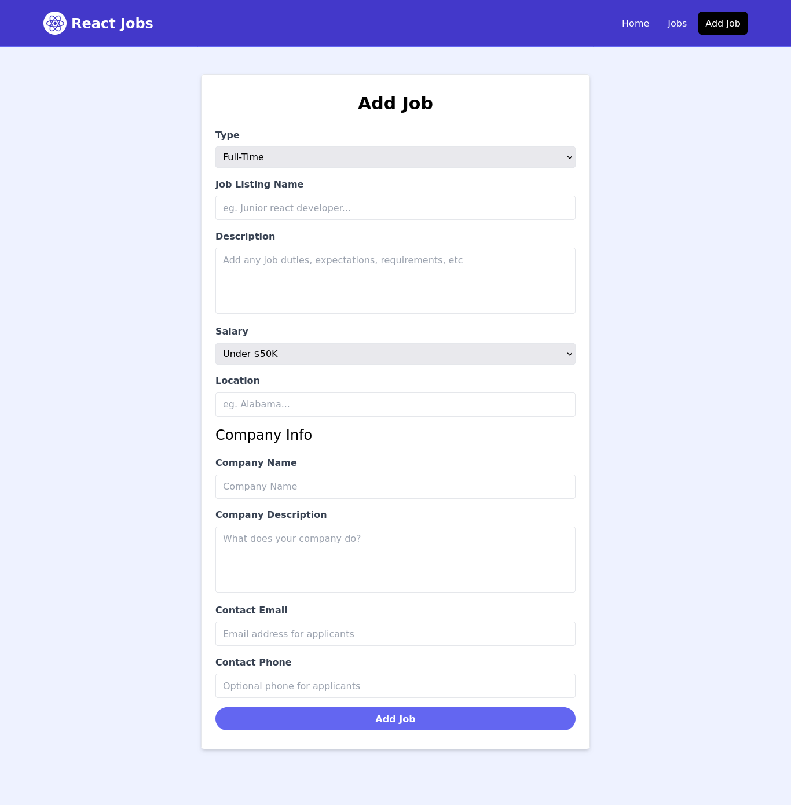
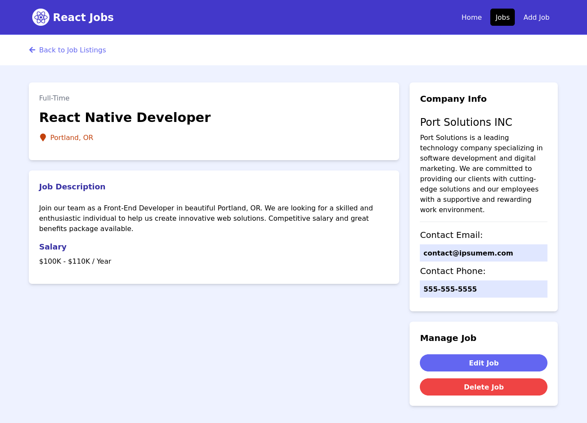

# 🚀 React Job Portal 🚀

## 📋 Overview

The **React Job Portal** is a web application designed for managing and browsing job listings. It provides a user-friendly interface for both job seekers and employers.

## ⚙️ Prerequisites

Before you start, ensure you have the following installed:

- **[Node.js](https://nodejs.org/)**: Essential for running the application and managing dependencies.

## 🔧 Installation

### 📂 Clone the Repository

Clone the repository to your local machine:

```bash
git clone https://github.com/iramamy/JobPortal.git
cd JobPortal
```

## 📦 Install Dependencies

Install the required npm packages:
```bash
npm install
```

## 🚀 Running the Application
### 🛠️ Start the JSON Server

The JSON Server simulates a backend API for job listings. Run it with:
```bash
npm run server
```

The JSON Server will be available at [http://localhost:2000/jobs](http://localhost:2000/jobs).

### 🔥 Start the React Application

With the JSON Server running, start the React development server with:
```bash
npm run dev
```

The React application will be available at [http://localhost:3000](http://localhost:3000)

**Note:** All job listings provided are purely fictional and intended for demonstration purposes only.

## Preview





## Dependencies

- `@material-tailwind/react`
- `@mui/material`
- `formik`
- `react`
- `react-dom`
- `react-icons`
- `react-modal`
- `react-router-dom`
- `react-scroll-to-top`
- `react-search-autocomplete`
- `react-spinners`
- `react-toastify`
- `yup`
